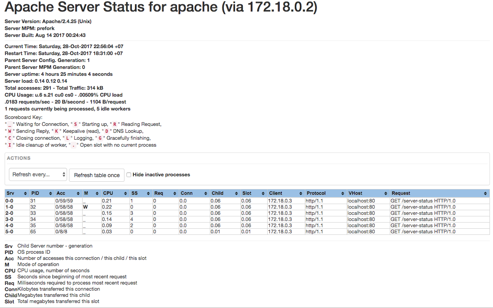

# ApacheStatusBeautifier

Tiny Chrome extension suggests another UI for your Apache server-status page and some additional possibilities.

## Usage

Extension automatically recognizes apache server status page and transform it into more informative representation.

# Known Limitations:

* `ExtendedStatus` mode must be enabled;

* extension recognizes only default url `/server-status`;

* works correctly for single node instance.
